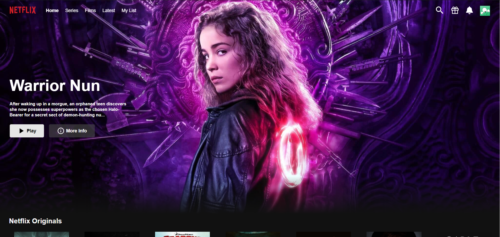
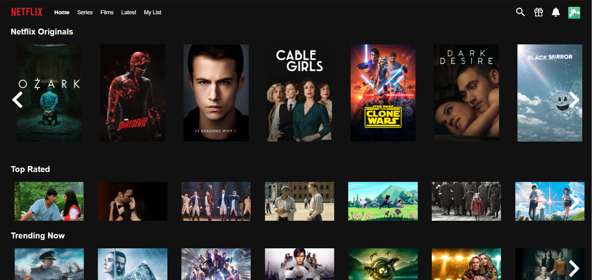
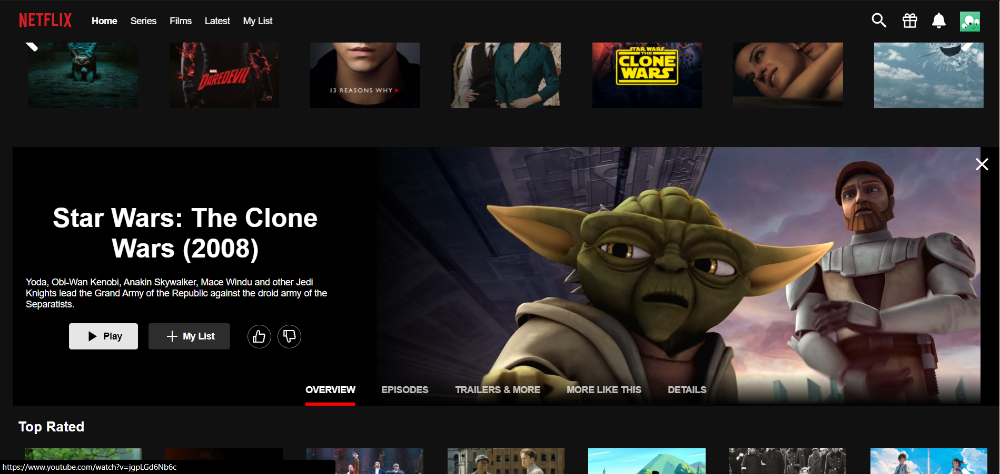

<h1 align="center">Netflux WEB</h1>

<p align="center">Netflix clone with backend, frontend and mobile using Node.js, ReactJs and React Native</p>

<p align="center">
  
</p>
<p align="center">
  
</p>
<p align="center">
  
</p>
<p align="center">
  
</p>
<p align="center">
  
</p>

## :computer: Technologies

* [ReactJS](https://reactjs.org/)
* [Axios](https://www.npmjs.com/package/axios)
* [Editor Config](https://marketplace.visualstudio.com/items?itemName=EditorConfig.EditorConfig)
* [Formik](https://www.npmjs.com/package/formik)
* [Movie Trailer](https://www.npmjs.com/package/movie-trailer)
* [Pure React Carousel](https://www.npmjs.com/package/pure-react-carousel)
* [React Icons](https://www.npmjs.com/package/react-icons)
* [React Router Dom](https://www.npmjs.com/package/react-router-dom)
* [React Toastify](https://www.npmjs.com/package/react-toastify)
* [React Youtube](https://www.npmjs.com/package/react-youtube)
* [Styled Components](https://www.npmjs.com/package/styled-components)
* [Yup](https://www.npmjs.com/package/yup)
* [VS Code](https://code.visualstudio.com/) with [ESLint](https://marketplace.visualstudio.com/items?itemName=dbaeumer.vscode-eslint)

## :information_source: How To Use

To clone and run this application, you'll need [Git](https://git-scm.com) installed on your computer and  [netflux-api](https://github.com/filipem2210/netflux-api). From your command line:

```bash
# Clone this repository
$ git clone https://github.com/filipem2210/netflux-web

# Go into the repository
$ cd netflux-web

# Install dependencies
$ yarn install

# Run the app
$ yarn start
```

## :memo: License

This project is under the MIT license. See the [LICENSE](https://github.com/filipem2210/netflux-web/blob/master/LICENSE) for more information.

## :mortar_board: Author

| [<br><sub>@filipem2210</sub>](https://github.com/filipem2210) |
| :-----------------------------------------------------------------------------------------------------------------------------------------------------------------------------: |
